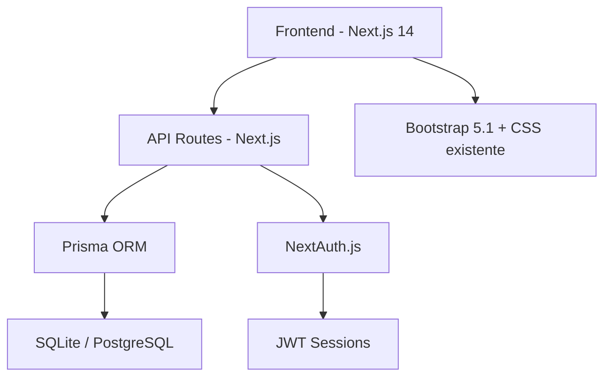
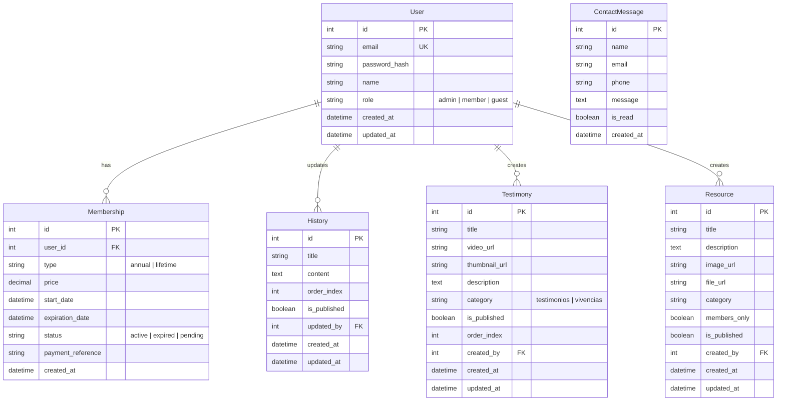

# Plan de Migración: CCI AL El Salvador — Sitio Estático a Dinámico

## Contexto

El sitio web actual de **CCI AL El Salvador** es un sitio estático generado con Mobirise, compuesto por 10 páginas HTML con Bootstrap 5.1, CSS personalizado y fuente Inter de Google Fonts. No tiene backend, base de datos ni sistema de autenticación.

### Estado Actual del Sitio

| Página | Contenido | Prioridad Dinámica |
|--------|-----------|---------------------|
| `index.html` | Inicio: Misión, Visión, Quiénes Somos, Junta Directiva, Contactos | Baja (mayormente estático) |
| `historia.html` | Texto largo sobre la historia de CCI AL SV | 🔴 Alta |
| `valores.html` | Valores fundamentales de CCI AL | Baja |
| `normas.html` | Normas organizacionales | Baja |
| `enciclopedia.html` | Enciclopedia de juegos (20 tomos) | Media |
| `curriculum.html` | Curriculum de CCI AL | Media |
| `testimonio.html` | Videos de YouTube + testimonios | 🔴 Alta |
| `recursos.html` | Recursos para miembros (actualmente tiene contenido placeholder) | 🔴 Alta |
| `membresia.html` | Información de membresía ($15) y pago | 🔴 Alta |
| `contactanos.html` | Formulario de contacto + datos de contacto | 🔴 Alta |

---

## User Review Required

> [!IMPORTANT]
> **Elección de tecnología**: Se propone **Next.js 14** con App Router como framework fullstack. Esto permite Server-Side Rendering (SSR), API Routes integradas, y una experiencia de desarrollo unificada entre frontend y backend. Si prefieres otra tecnología (Express.js puro, Laravel, etc.), por favor indicar antes de iniciar.

> [!IMPORTANT]
> **Base de datos**: Se propone **SQLite** con **Prisma ORM** para empezar (simple, sin necesidad de servidor externo). Si prefieres **MySQL** o **PostgreSQL**, el esquema se adaptaría fácilmente con Prisma. ¿Cuál prefieres?

> [!WARNING]
> **Hosting y Deployment**: El sitio actual puede estar alojado como archivos estáticos (GitHub Pages, etc.). La versión dinámica necesitará un servidor que soporte Node.js (Vercel, Railway, VPS, etc.). Esto deberá definirse.

> [!CAUTION]
> **Formulario de contacto**: El formulario actual en `contactanos.html` tenía `action="https://mobirise.eu/"` (ya cambiado a `#`). Se necesita definir si los mensajes de contacto se guardarán en base de datos, se enviarán por email, o ambos.

---

## Stack Tecnológico Propuesto



| Componente | Tecnología | Justificación |
|-----------|------------|---------------|
| **Framework** | Next.js 14 (App Router) | Fullstack, SSR, API unificada |
| **Base de Datos** | SQLite → PostgreSQL | Simple para desarrollo, migrable a producción |
| **ORM** | Prisma | Type-safe, migraciones automáticas |
| **Autenticación** | NextAuth.js v5 | Login/registro, sesiones JWT, roles |
| **Estilos** | Bootstrap 5.1 + CSS actual | Conservar el diseño actual |
| **Formularios** | React Hook Form | Validación client-side |

---

## Esquema de Base de Datos



---

## Proposed Changes

### Fase 1 — Configuración del Proyecto

Inicializar el proyecto Next.js dentro del repositorio existente, preservando todos los assets y estilos actuales.

#### [NEW] `package.json`
- Proyecto Next.js 14 con dependencias: `next`, `react`, `prisma`, `@prisma/client`, `next-auth`, `bcryptjs`, `react-hook-form`

#### [NEW] `next.config.js`
- Configuración de Next.js con soporte para imágenes externas (YouTube thumbnails)

#### [NEW] `prisma/schema.prisma`
- Esquema completo de la base de datos con todas las tablas descritas arriba

#### [NEW] `prisma/seed.js`
- Script para migrar el contenido actual (historia, datos de contacto) a la base de datos

#### [NEW] `src/app/layout.js`
- Layout raíz con los estilos Bootstrap 5.1, Inter font, y CSS existente
- Navbar global (extraída del HTML actual)
- Footer global

#### [NEW] `src/components/Navbar.jsx`
- Componente de navegación reutilizable, extraído del HTML actual
- Incluirá lógica condicional para mostrar/ocultar opciones según el rol del usuario

#### [NEW] `src/components/Footer.jsx`
- Componente de footer reutilizable

---

### Fase 2 — Sistema de Autenticación

#### [NEW] `src/app/api/auth/[...nextauth]/route.js`
- Configuración de NextAuth.js con Credentials Provider
- Validación de email + contraseña hasheada (bcrypt)
- Verificación de membresía activa/expirada en la sesión

#### [NEW] `src/app/login/page.jsx`
- Página de login con formulario de email y contraseña
- Redirección post-login según rol
- Manejo de errores (credenciales inválidas, membresía expirada)

#### [NEW] `src/middleware.js`
- Middleware para proteger rutas (recursos exclusivos para miembros)
- Verificación de sesión y redirección a login

#### [NEW] `src/lib/auth.js`
- Utilidades de autenticación: hash de contraseñas, verificación

---

### Fase 3 — Páginas Dinámicas

#### [NEW] `src/app/page.jsx` (Inicio)
- Migración del `index.html` actual a componente React
- Secciones: Hero, Qué Hacemos, Misión/Visión, Quiénes Somos, Declaración de Fe, Junta Directiva, Contactos

#### [NEW] `src/app/historia/page.jsx`
- Contenido cargado desde la base de datos (tabla `History`)
- Renderizado de HTML rico (contenido editable desde admin)

#### [NEW] `src/app/testimonios/page.jsx`
- Lista de testimonios desde BD (tabla `Testimony`)
- Categorías: "Testimonios de CCItos" y "Vivencias de Cursos y Talleres"
- Embed de videos de YouTube dinámico

#### [NEW] `src/app/recursos/page.jsx`
- Lista de recursos desde BD (tabla `Resource`)
- Algunos recursos restringidos solo para miembros con membresía activa
- Validación de acceso en server-side

#### [NEW] `src/app/membresia/page.jsx`
- Información de membresía
- Estado de membresía del usuario (si está logueado)
- Fecha de vencimiento visible
- Botón de pago (inicialmente manual, link a email)

#### [NEW] `src/app/contactanos/page.jsx`
- Formulario de contacto funcional
- Los mensajes se guardan en BD (tabla `ContactMessage`)
- Validación server-side y client-side

#### [NEW] `src/app/api/contact/route.js`
- API Route para recibir y guardar mensajes de contacto

#### Páginas que se migran "tal cual" (contenido estático en componentes):
- `src/app/valores/page.jsx` — Valores de CCI AL
- `src/app/normas/page.jsx` — Normas de CCI AL
- `src/app/enciclopedia/page.jsx` — Enciclopedia de Juegos
- `src/app/curriculum/page.jsx` — Curriculum de CCI AL

---

### Fase 4 — Panel de Administración

#### [NEW] `src/app/admin/layout.jsx`
- Layout del panel de admin con navegación lateral
- Protegido: solo rol `admin`

#### [NEW] `src/app/admin/page.jsx`
- Dashboard con resumen: miembros activos, mensajes nuevos, testimonios

#### [NEW] `src/app/admin/historia/page.jsx`
- Editor CRUD para la sección de Historia
- Editor de texto enriquecido (contenido HTML)

#### [NEW] `src/app/admin/testimonios/page.jsx`
- CRUD de testimonios: agregar/editar URLs de YouTube, título, categoría

#### [NEW] `src/app/admin/recursos/page.jsx`
- CRUD de recursos: agregar archivos, definir si es solo para miembros

#### [NEW] `src/app/admin/miembros/page.jsx`
- Gestión de miembros: ver lista, activar/desactivar membresía, ver fechas de vencimiento

#### [NEW] `src/app/admin/mensajes/page.jsx`
- Bandeja de mensajes de contacto recibidos
- Marcar como leído/no leído

#### [NEW] `src/app/api/admin/[...route]/route.js`
- API Routes protegidas para todas las operaciones CRUD del admin

---

### Fase 5 — Sistema de Membresía con Vencimiento

#### [NEW] `src/lib/membership.js`
- Lógica de verificación de membresía activa
- Función para verificar si la membresía ha expirado (comparando `expiration_date` con fecha actual)
- Middleware de acceso a recursos protegidos

#### [MODIFY] `src/middleware.js`
- Agregar verificación de membresía vigente para rutas de recursos exclusivos
- Redirigir a página de renovación si la membresía está vencida

#### [NEW] `src/app/membresia/renovar/page.jsx`
- Página que muestra al usuario que su membresía venció
- Instrucciones para renovar

---

## Estructura Final del Proyecto

```
ccialsv/
├── prisma/
│   ├── schema.prisma          # Esquema de BD
│   ├── seed.js                # Datos iniciales
│   └── dev.db                 # SQLite (desarrollo)
├── public/
│   └── assets/                # Todos los assets actuales (imágenes, CSS, JS)
├── src/
│   ├── app/
│   │   ├── layout.js          # Layout global
│   │   ├── page.jsx           # Inicio
│   │   ├── login/page.jsx     # Login
│   │   ├── historia/page.jsx
│   │   ├── valores/page.jsx
│   │   ├── normas/page.jsx
│   │   ├── enciclopedia/page.jsx
│   │   ├── curriculum/page.jsx
│   │   ├── testimonios/page.jsx
│   │   ├── recursos/page.jsx
│   │   ├── membresia/page.jsx
│   │   ├── contactanos/page.jsx
│   │   ├── admin/             # Panel de administración
│   │   │   ├── layout.jsx
│   │   │   ├── page.jsx
│   │   │   ├── historia/page.jsx
│   │   │   ├── testimonios/page.jsx
│   │   │   ├── recursos/page.jsx
│   │   │   ├── miembros/page.jsx
│   │   │   └── mensajes/page.jsx
│   │   └── api/
│   │       ├── auth/[...nextauth]/route.js
│   │       ├── contact/route.js
│   │       └── admin/[...route]/route.js
│   ├── components/
│   │   ├── Navbar.jsx
│   │   ├── Footer.jsx
│   │   └── ...
│   ├── lib/
│   │   ├── auth.js
│   │   ├── prisma.js
│   │   └── membership.js
│   └── middleware.js
├── package.json
├── next.config.js
└── README.md                  # (actualizado)
```

---

## Verification Plan

### Pruebas Manuales (Paso a Paso)

#### 1. Verificación del Login
1. Abrir el sitio en `http://localhost:3000/login`
2. Intentar login con credenciales incorrectas → debe mostrar error
3. Login con credenciales de admin → debe redirigir al dashboard admin
4. Login con credenciales de miembro → debe redirigir a inicio con opciones de miembro visibles

#### 2. Verificación de Páginas Dinámicas
1. Navegar a `http://localhost:3000/historia` → debe mostrar contenido de la BD
2. Ir al admin `http://localhost:3000/admin/historia` → editar contenido
3. Volver a `http://localhost:3000/historia` → debe mostrar el contenido actualizado

#### 3. Verificación de Membresía con Vencimiento
1. Login como miembro con membresía activa → acceder a Recursos ✅
2. Cambiar manualmente la fecha de vencimiento a una fecha pasada en la BD
3. Refrescar la página de Recursos → debe redirigir a página de renovación

#### 4. Verificación del Formulario de Contacto
1. Navegar a `http://localhost:3000/contactanos`
2. Llenar nombre, email, teléfono
3. Enviar → debe mostrar mensaje de éxito
4. Ir a `http://localhost:3000/admin/mensajes` como admin → debe aparecer el mensaje

#### 5. Verificación Visual (comparación con sitio original)
1. Abrir el sitio estático original en un navegador
2. Abrir el nuevo sitio dinámico en otra pestaña
3. Comparar visualmente cada página para asegurar que el diseño se mantuvo

### Pruebas Automatizadas (Propuesta)
- Se exploraría agregar tests básicos con **Jest** + **React Testing Library** para los componentes principales
- Tests de API con `supertest` o pruebas directas en los API Routes
- Pregunta al usuario: ¿Deseas que se incluyan tests automatizados en el desarrollo inicial, o se agregarán en una fase posterior?

---

## Cronograma Estimado de Implementación

| Fase | Descripción | Estimación |
|------|-------------|------------|
| 1 | Configuración proyecto + BD | 1 sesión |
| 2 | Sistema de autenticación | 1 sesión |
| 3 | Páginas dinámicas (5 páginas) | 2–3 sesiones |
| 4 | Panel de administración | 2–3 sesiones |
| 5 | Sistema de membresía | 1 sesión |
| 6 | Pruebas y ajustes | 1 sesión |
